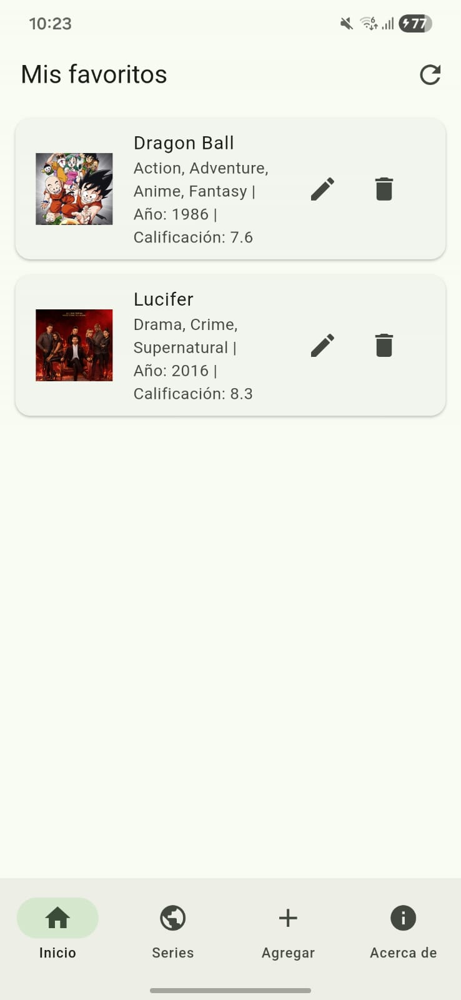
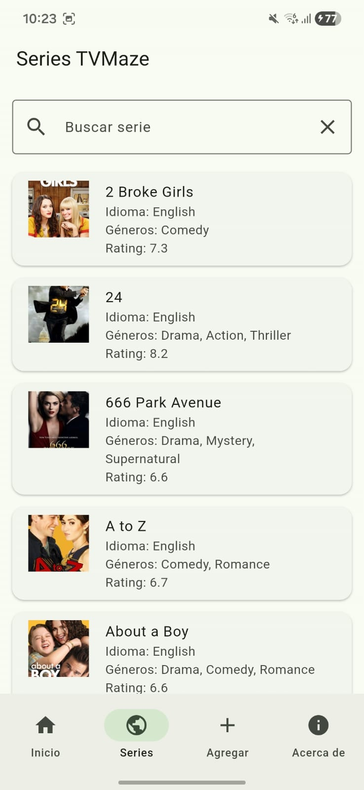
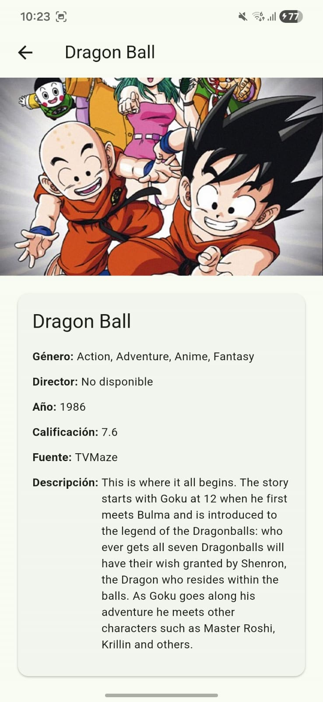

🎬 CRUD de Películas y Series con Flutter, MongoDB y TVMaze API

📖 Descripción

Aplicación desarrollada en Flutter que permite gestionar un catálogo de películas y series mediante un sistema CRUD (Crear, Leer, Actualizar y Eliminar) conectado a MongoDB Atlas.

Además, la aplicación integra la API pública TVMaze, permitiendo buscar series de televisión, visualizar sus detalles y guardarlas en la colección de favoritos almacenada en la base de datos.

El proyecto fue desarrollado como práctica académica para la asignatura de Desarrollo de Software, aplicando conceptos de:

Desarrollo de aplicaciones móviles multiplataforma con Flutter.
Consumo de APIs REST.
Integración con bases de datos NoSQL (MongoDB Atlas).
Manejo de navegación entre pantallas.
Arquitectura basada en widgets y gestión de estados.
✨ Características
🎬 Gestión de Películas (CRUD)
Crear nuevas películas.
Visualizar películas registradas.
Editar información de películas.
Eliminar películas.
Ver detalles completos de cada película.
📺 Integración con TVMaze API
Consulta de series de televisión.
Búsqueda dinámica por nombre.
Scroll infinito de series.
Ordenamiento alfabético.
Visualización de información detallada:
Imagen
Nombre
Géneros
Idioma
Rating
Estado
Fecha de estreno
Resumen
⭐ Sistema de Favoritos

Desde la pantalla de detalles de una serie, el usuario puede:

Guardar una serie en MongoDB Atlas.
Evitar registros duplicados.
Visualizar las series guardadas desde la sección Mis Películas.
🏗️ Arquitectura del Proyecto
lib/
│
├── db/
│   └── mongo_database.dart
│
├── models/
│   └── peliculas.dart
│
├── pages/
│   ├── menu_page.dart
│   ├── home_page.dart
│   ├── form_page.dart
│   ├── detail_page.dart
│   ├── api_page.dart
│   ├── detail_api_page.dart
│   └── about_page.dart
│
├── services/
│   └── services.dart
│
└── main.dart
🛠️ Tecnologías Utilizadas
Tecnología	Descripción
Flutter	Framework multiplataforma
Dart	Lenguaje de programación
MongoDB Atlas	Base de datos NoSQL en la nube
TVMaze API	API pública de series de televisión
HTTP Package	Consumo de servicios REST
UUID	Generación de identificadores únicos
Material Design 3	Diseño de interfaz
🌐 API Utilizada
TVMaze API

API pública utilizada para consultar información de series de televisión.

Obtener series:
https://api.tvmaze.com/shows?page=0
Buscar una serie:
https://api.tvmaze.com/search/shows?q=nombre

Documentación oficial:

TVMaze API Documentation

🗄️ Base de Datos

La aplicación utiliza MongoDB Atlas para almacenar:

{
  "id": "uuid",
  "titulo": "Breaking Bad",
  "genero": "Drama, Crime",
  "director": "No disponible",
  "anio": 2008,
  "calificacion": 9.5,
  "poster": "url_imagen",
  "descripcion": "Serie de televisión...",
  "fuente": "TVMaze"
}
📱 Pantallas de la Aplicación
🏠 HomePage
Lista de películas favoritas.
Editar películas.
Eliminar películas.
Ver detalles.
📺 ApiPage
Consulta de series desde TVMaze.
Scroll infinito.
Búsqueda de series.
🔍 DetailApiPage
Información detallada de la serie.
Guardar en favoritos.
➕ FormPage
Registro manual de películas.
ℹ️ AboutPage
Integrantes.
Información técnica.
API utilizada.
Capturas del proyecto.
📸 Capturas

Agregar las imágenes en:

assets/images/
├── home.png
├── api.png
├── detail.png
└── about.png

Ejemplo:

🚀 Instalación
1. Clonar el repositorio
git clone https://github.com/usuario/nombre-repositorio.git
2. Entrar al proyecto
cd nombre-repositorio
3. Instalar dependencias
flutter pub get
4. Ejecutar la aplicación
flutter run
📦 Dependencias Principales
dependencies:
  flutter:
    sdk: flutter
  http:
  mongo_dart:
  uuid:

Instalarlas:

flutter pub get
🎯 Competencias Desarrolladas
Desarrollo de aplicaciones móviles con Flutter.
Consumo de APIs REST.
Integración con bases de datos NoSQL.
Programación orientada a objetos.
Gestión de estados y navegación.
Diseño de interfaces con Material Design.
Implementación de operaciones CRUD.
👨‍💻 Integrantes
Roger Greff
[Nombre Integrante 2]
[Nombre Integrante 3]

Carrera: Desarrollo de Software

📚 Proyecto Académico

Proyecto desarrollado para fines educativos en la carrera de Desarrollo de Software, integrando Flutter, MongoDB Atlas y la API pública TVMaze para la gestión de películas y series de televisión.

📄 Licencia

Este proyecto se distribuye bajo la licencia MIT.

MIT License © 2026 Roger Greff
